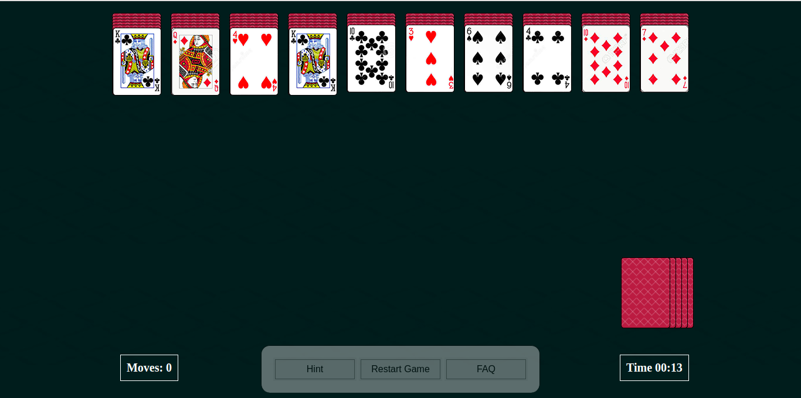
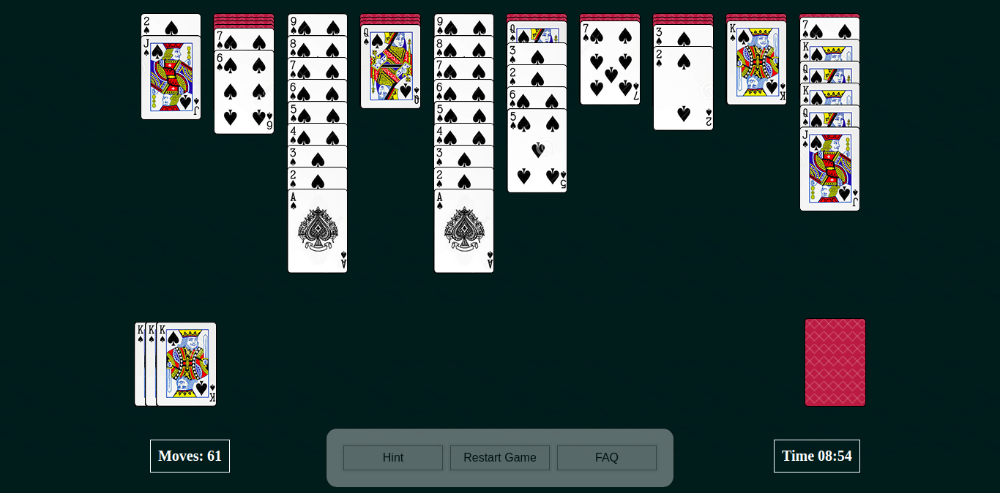
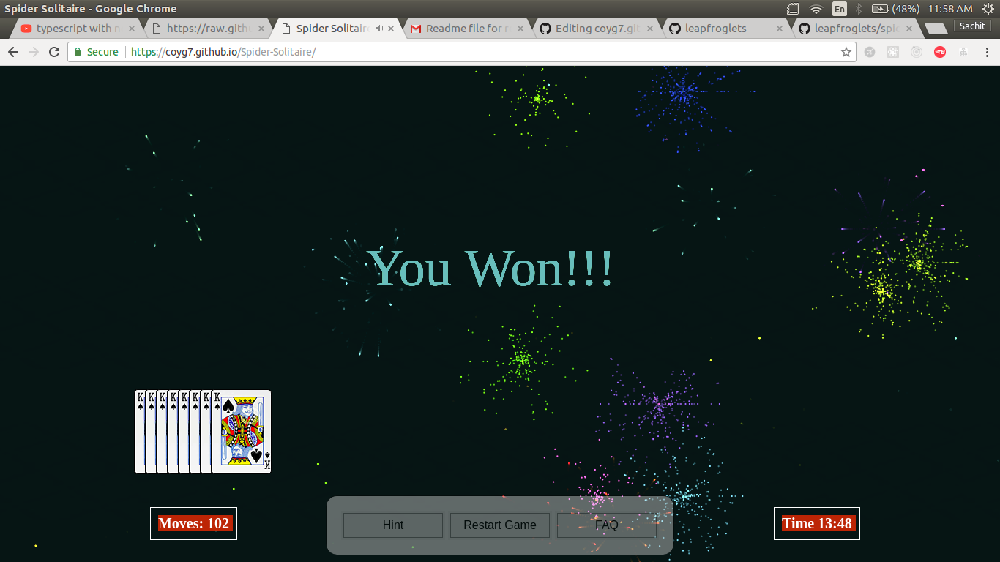

# Spider Solitaire – SpiderImp

Free online Spider Solitaire at [spiderimp.com](https://spiderimp.com).

Built with vanilla JavaScript and HTML canvas animations.

Open `index.html` in a browser to play locally, or deploy the folder to any static host (Cloudflare Pages, Netlify, etc.).

## How to Play
Arrange same-suit cards from King to Ace. Completed sequences move to the Completed area (top, beside the deal pile). Drag cards between columns. Click the stock pile (top-left) to deal one card to each column when no columns are empty.

## Game Modes
* 1 Suit
* 2 Suits
* 4 Suits

## Features
* Daily Challenge (same deal each day per difficulty)
* Best scores by difficulty (moves + time)
* Sound / volume control
* Undo, Hint, Pause, Restart, and return to main menu
* Resume unfinished games
* Share / copy win score

## Screenshots
Game Start

Mid game

Game Over

