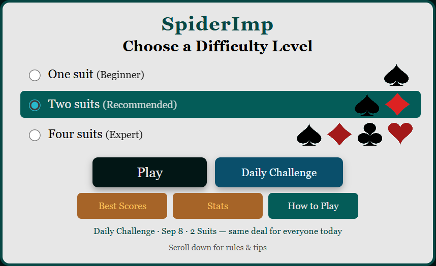
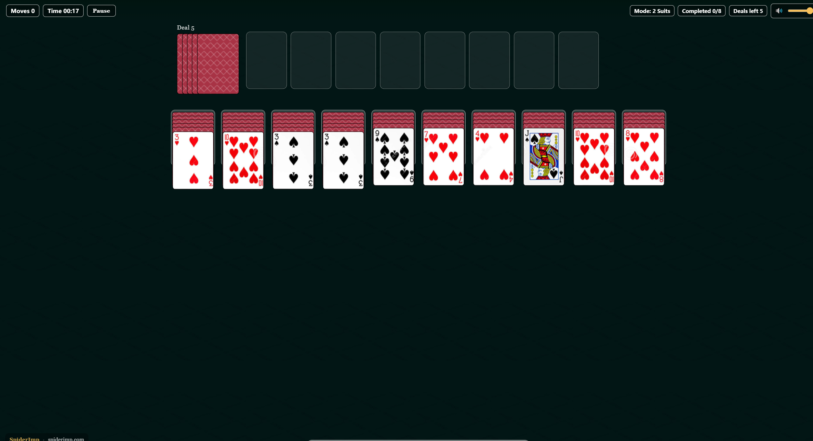
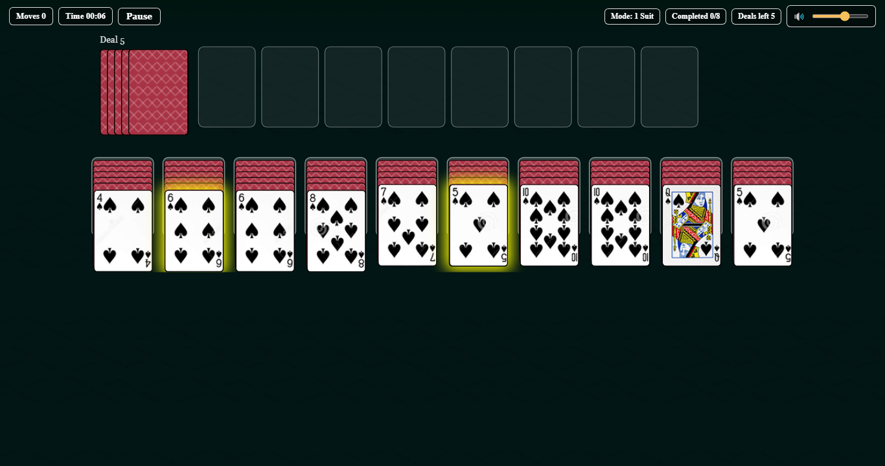

# SpiderImp – Free Spider Solitaire Online

**Play now:** [https://spiderimp.com/](https://spiderimp.com/)

Free browser Spider Solitaire — **no download**, no signup, no ads.  
Recommended default: **2 suits**. Also 1 suit (beginner) and 4 suits (expert).

- Windows 11 alternative (classic Solitaire missing?): [Get Spider Solitaire back](https://spiderimp.com/windows-spider-solitaire)
- [2 suits guide](https://spiderimp.com/spider-solitaire-2-suits) · [No download](https://spiderimp.com/spider-solitaire-no-download) · [How to play](https://spiderimp.com/how-to-play)

Built with vanilla JavaScript. Open `index.html` locally, or deploy this folder to any static host (Cloudflare Pages, Netlify, GitHub Pages, etc.).

## How to Play

Arrange same-suit cards from King to Ace. Completed sequences move to the Completed area (top, beside the deal pile). Drag cards between columns. Click the stock pile (top-left) to deal one card to each column when no columns are empty.

## Game Modes

- 1 Suit (Beginner)
- 2 Suits (Recommended)
- 4 Suits (Expert)

## Features

- Daily Challenge (same deal each day per difficulty)
- Best scores by difficulty (moves + time)
- Sound / volume control
- Undo, Hint, Pause, Restart, and return to main menu
- Resume unfinished games
- Share / copy win score

## Screenshots

Main menu (2 suits recommended)  

Gameplay  

Building runs (hint highlight)  

## Links

| | URL |
|---|---|
| Live site | https://spiderimp.com/ |
| This repo | https://github.com/eric4885/spiderimp |

## License

Site content and game code in this repository — see repository files for asset attribution where applicable.
